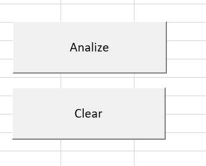
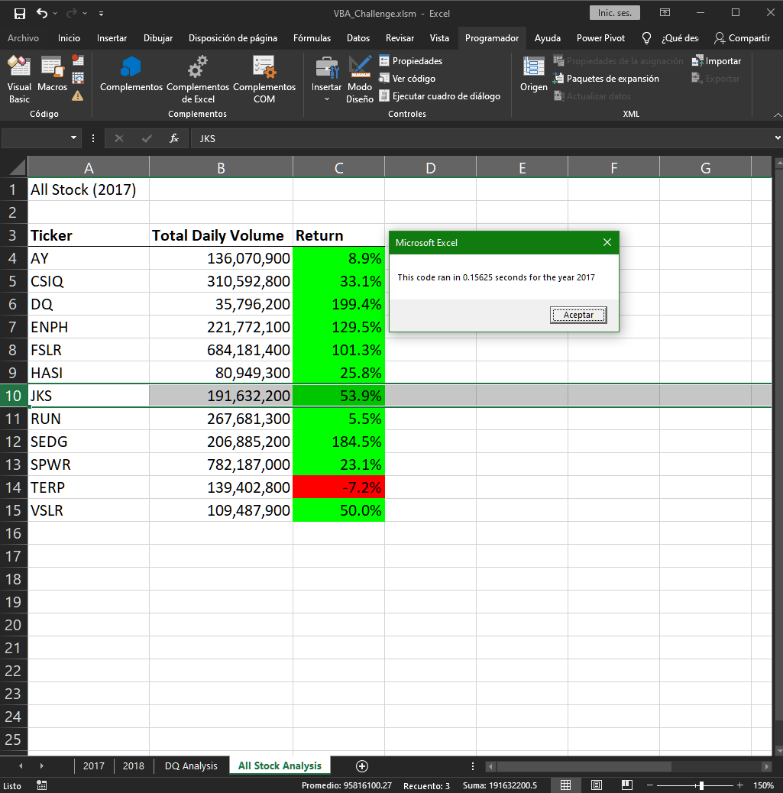
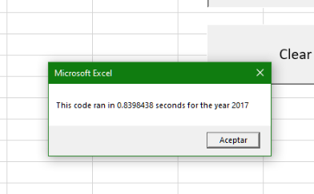
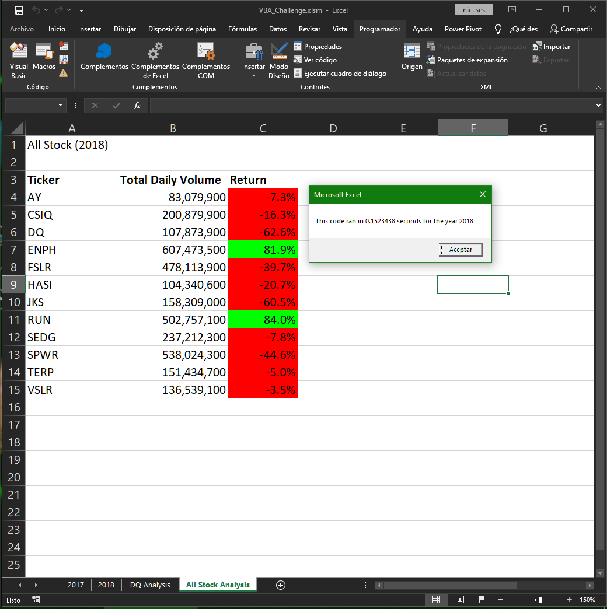
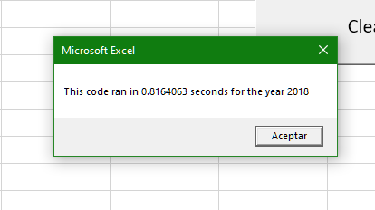
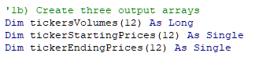
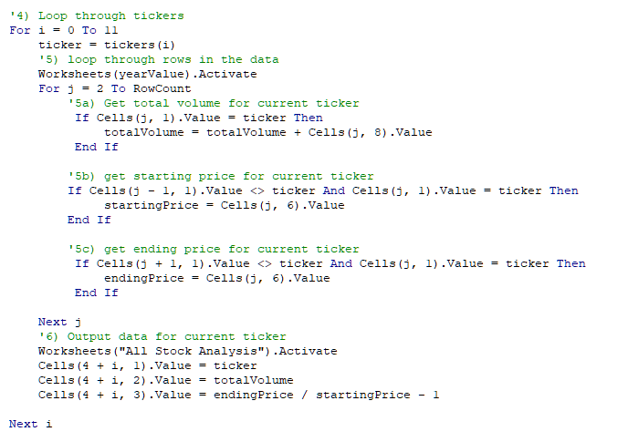

# Second Challenge
# **VBA Challenge**

### **1. Overview of Project**

  This challenge is about giving us information using VBA Macros with our example stock years. Also using this macros we can give formatting to the data sheet and create buttons to start a macro. 

  The challenge is using macros with VBA, using ***for loops*** and ***if statements*** with all the information given in the 2017 and 2018 data sheets, looping through the arrays created and all the rows in order to collect and save the data in the arrays.

### **2. Results** 
  
  To get started we create the buttons to initialize the macros and this way we make this user-friendly.

  

  Then we start the macro with the ***2017 datasheet***.

  

  The result of the macro running shows us that this code is faster than the first that we made while we were working.

  

  Then we use the **2018 datasheet** 
  
  

  Now we see are going to see the time that was taken with our lastest code. 
  
  

  Using the array variables we declared we can make the code take less time to process than before.
  Because as we can see the **for loop** that iterates all the rows in the spreadsheet is similar to the last one.

  
  
  **_Variables created in the new Macro_**

  This variables receive and store all the data we find through the spread sheet, and because this are arrays, we use the size of this one to store the data, while in the last macro we assign a value to the variables and then we change it, this takes more time and if we have a spread sheet that we want to analyze with more rows and data, the Refactored code will take less time than the old one.

  

  
  
  ## **3. Summary**
  1. What are the advantages or disadvantages of refactoring code?
    
    The advantages is that as we can see it could take less time to run the code and we can look for some errors. Also this way we can make aour code more readable and undestandable.

    But sometimes there is no time to refactor a code and we have to work with the actual code.

  2. How do these pros and cons apply to refactoring the original VBA script?

    Apply because the code is cleanear and if someone else read it he could understand what is going on and its porpouse, also it takes less time to run.

  

